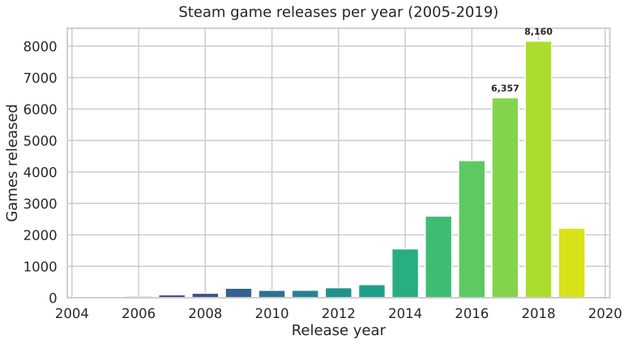
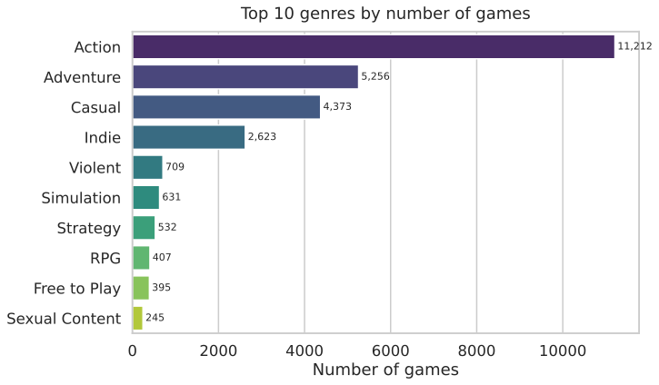
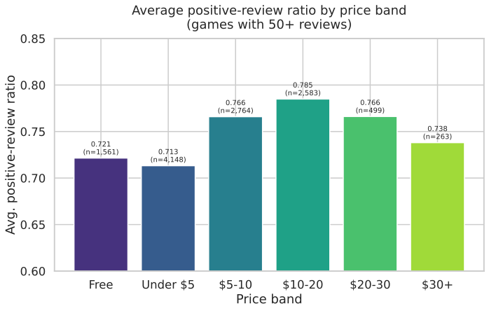
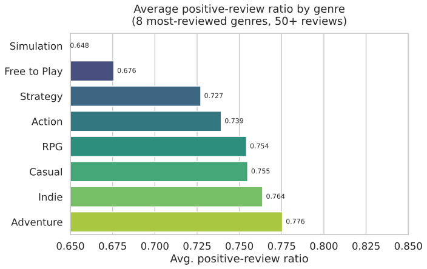
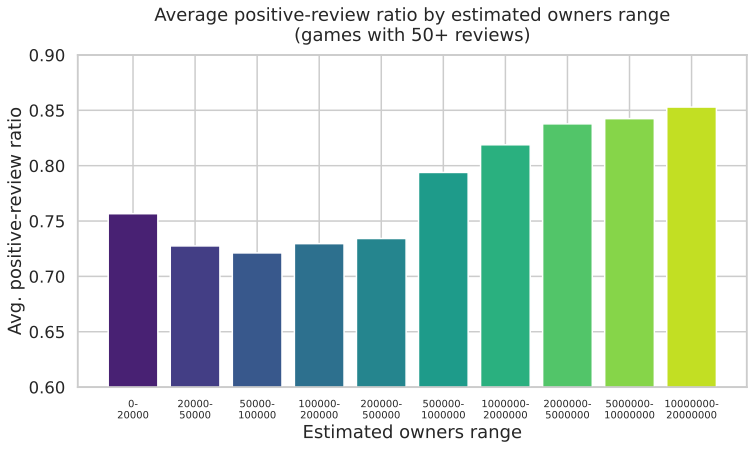

# Steam Games Data Analysis

Exploratory analysis of **27,075 Steam store games (1997–2019)** — release trends, genre landscape, pricing, and what player reviews reveal about price, popularity, and quality.

## Dataset

- **Source:** "Steam Store Games" by Nik Davis — https://www.kaggle.com/datasets/nikdavis/steam-store-games (CC-BY 4.0)
- **File:** `data/steam.csv` (27,075 rows × 18 columns) — download it from the Kaggle page above (free account required) and place it in the `data/` folder. The CSV is too large to bundle in the repo.
- Columns include release date, developer/publisher, platforms, genres, review counts (positive/negative), playtime, estimated owners range, and price (USD).

## Key findings

1. **Steam's catalog exploded after 2013.** Releases grew from 418 games in 2013 to a peak of **8,160 in 2018** — the Greenlight/Steam Direct era turned Steam into a long-tail storefront where the vast majority of titles sit in the 0–20,000 owners range.
2. **It's a budget storefront.** Only 9.5% of games are free-to-play and the median paid game costs **$4.79**. Cheapest isn't best-received: games under $5 average the **lowest** positive-review ratio (0.713), while the **$10–20 band scores highest (0.785)** — suggesting mid-priced games are where players feel they get their money's worth.
3. **Action dominates, Adventure delights.** Action is the top genre (11,212 games), but Adventure games earn the highest average positive-review ratio (0.776) among major genres.
4. **Popularity and sentiment move together.** Blockbusters with 5M+ estimated owners average 0.84+ positive reviews versus 0.76 for the long tail — and review volume is concentrated at the top: CS:GO alone has 3.05M reviews (86.8% positive), while PUBG's 983K reviews sit at just 50.5% positive.

## Tech stack

Python · pandas · NumPy · matplotlib · seaborn

## Charts

| # | Chart | Question answered |
|---|-------|-------------------|
| 1 |  | How did Steam's catalog grow over time? |
| 2 |  | Which genres dominate the catalog? |
| 3 |  | Do pricier games get better reviews? |
| 4 |  | Which genres are best reviewed? |
| 5 |  | Are popular games better liked? |

## How to run

1. Download `steam.csv` from the Kaggle dataset page and save it as `data/steam.csv`.
2. Run the analysis:

```bash
pip install -r requirements.txt
python analysis.py
```

This regenerates all charts into `charts/` and prints the findings summary.

## Notes & limitations

- Sentiment stats use games with **50+ total reviews** to avoid noise from near-zero-review titles.
- Owners are SteamSpy-style estimated ranges, not audited sales figures.
- The dataset snapshot ends in May 2019, so it predates the last several years of Steam's growth.
